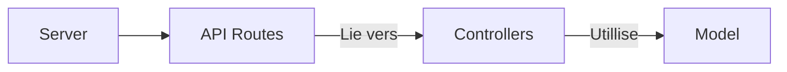

# StarTrader

Mini projet spatial (encore) avec une SPA Vue.Js, un backend Express et une bdd Mongo. Il s'inspire fortement de OGame, Anno, 

# feature
- créer son compte
- se connecter
- construire des trucs qui vont produire des choses à la surface de planètes
- puis établir des liens d'approvisionnement

TODO : 
- [ ] prod/dev mode

https://mermaid.js.org/intro/
https://expressjs.com/fr/4x/api.html
https://elijahmanor.com/blog/npm-precommit-scripts

DEBUG=*

https://expressjs.com/en/resources/middleware/cors.html
https://ideneal.medium.com/securing-authentication-in-a-spa-using-jwt-token-the-coolest-way-ab883bc372b6
https://medium.com/lightrail/getting-token-authentication-right-in-a-stateless-single-page-application-57d0c6474e3